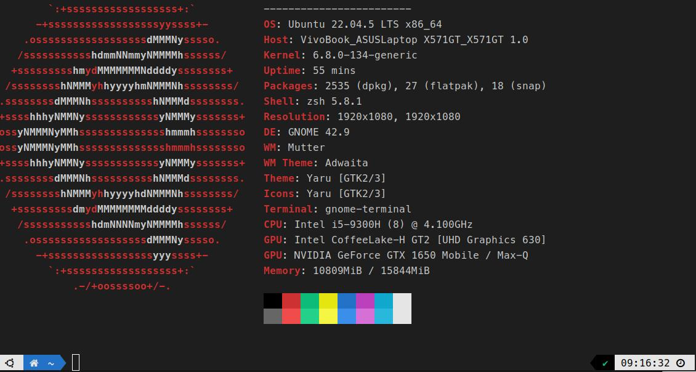

# terminal-settings-backup

終端機設定備份，可在新機器上一鍵還原。內容包含 GNOME Terminal 與 Guake 的設定、Guake 分頁 session，以及 Meslo Nerd Font 字型。

## 預覽



## 內容

| 檔案 / 資料夾 | 說明 |
| --- | --- |
| `restore.sh` | 一鍵還原腳本（安裝字型 + 載入設定 + 還原分頁 + 重啟 Guake） |
| `export.sh` | 一鍵匯出腳本（重新匯出目前設定並打包成 tar.gz） |
| `release.sh` | 一鍵發佈腳本（打包 + 建立 tag + 發佈 GitHub Release 並上傳附件） |
| `gnome-terminal.dconf` | GNOME Terminal 設定（`dconf` 匯出） |
| `guake.dconf` | Guake 設定（`dconf` 匯出） |
| `guake-session.json` | Guake 分頁 session（分頁清單與工作目錄） |
| `fonts/` | Meslo Nerd Font 字型檔（`.ttf`） |
| `screenshots/` | 風格預覽截圖 |

## 設定重點

- 配色：深色背景 `#1E1E1E`、前景 `#CCCCCC`（VS Code 風格調色盤）
- 字型：`MesloLGLDZ Nerd Font 12`
- 預設視窗：114 欄 × 24 列，關閉音效提示
- Guake：背景透明度 92%、`F10` 顯示／隱藏、開啟分頁自動儲存

## 還原方式

在本資料夾內執行：

```bash
./restore.sh
```

腳本會依序執行：

1. 將 `fonts/` 內的字型複製到 `~/.fonts/` 並更新字型快取；若系統缺 U+23F5（`⏵`）符號，會自動安裝 `fonts-symbola`（補齊 Claude Code 模式指示器符號）
2. 以 `dconf load` 還原 GNOME Terminal 設定（未安裝則略過）
3. 以 `dconf load` 還原 Guake 設定，並確保分頁自動儲存開啟（未安裝則略過）
4. 還原 Guake 分頁 session 並重啟 Guake

GNOME Terminal 開新分頁／視窗即可看到新風格。

## 備份方式

更新備份時，在本資料夾內執行：

```bash
./export.sh
```

腳本會重新匯出 GNOME Terminal 與 Guake 設定、備份 Guake 分頁 session、同步 Meslo 字型，並打包成 `~/terminal-settings-<日期>.tar.gz`。

## 發佈到 GitHub Releases

需先安裝並登入 [GitHub CLI](https://cli.github.com/)（`gh auth login`）。在本資料夾內執行：

```bash
./release.sh v1.0.0                        # release notes 自動產生
./release.sh v1.1.0 "修正 Guake 透明度"     # 額外附上本版變更說明
```

腳本會依序：確認工作區無未提交變更並 push → 執行 `export.sh` 打包 → 建立 tag → 以 `gh release create` 發佈 Release 並上傳 tar.gz 附件。release notes 由固定說明、傳入的變更說明，以及 `--generate-notes` 自動產生的 commit 清單組成。
